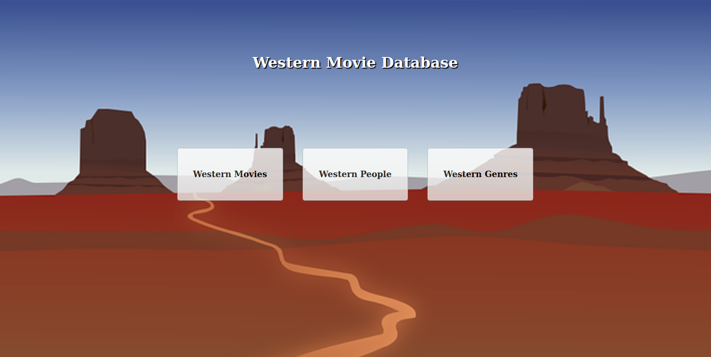
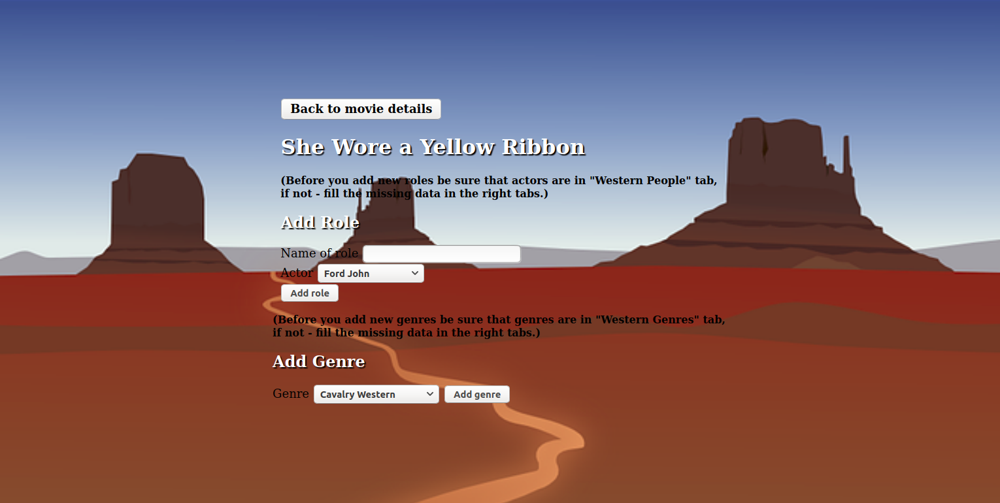
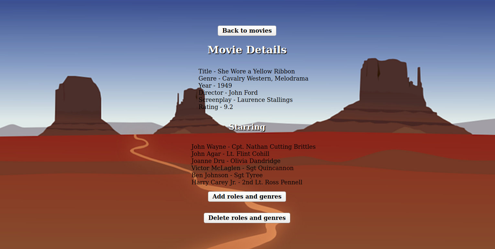

# western-movie-database v 2.0
Western database - second version of my first django project (also psql, html and css).

## How to run and use western movie database?
For Linux: you will need python3, django and postgresql.
- fork and clone repository or download all files,
- create virtualenv, using **virtualenv -p python3 env**,
- run virtualenv, using **source env/bin/activate**,
- instal django, using: **pip install django==3.0.7**,
- instal postgresql, using **sudo apt-get install postgresql**,
- configure psql, using data in **database_config** file (set username, host and password),
- load library database, using and editing command **psql -U [user_name] -W -f library_db_backup.sql -h localhost movie_database_db**
- run page, using **manage.py** file (in console: **python3 manage.py runserver**)
- go to your web browser and check is it works.

Enjoy :)
